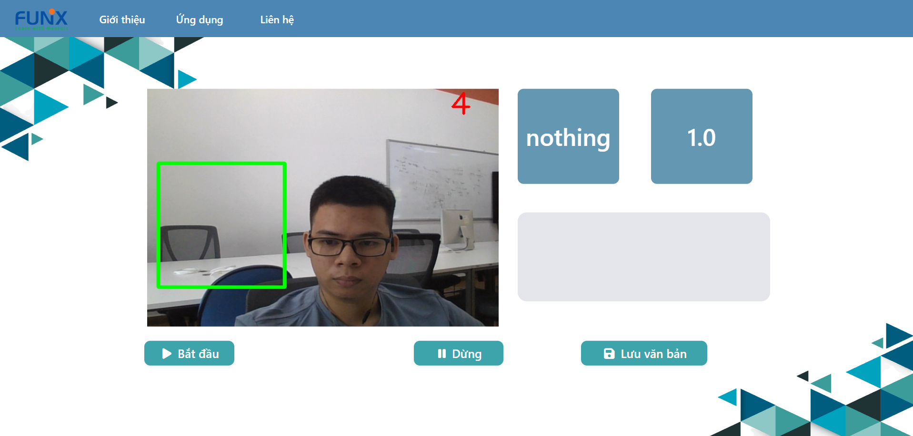

# ASL alphabet system

## Installation instructions

```
pip install -r requirements.txt
```

## Model classification


Code available at [notebook](train.ipynb)

## Deloyment
```
python main.py
```


